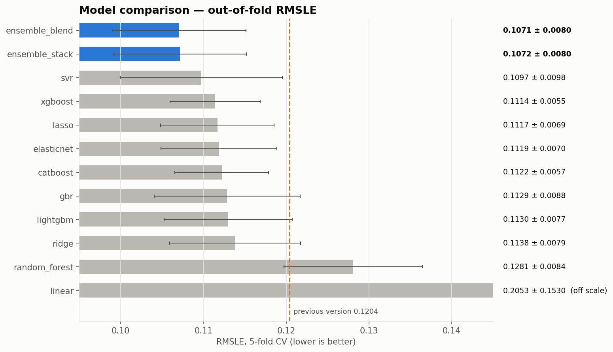
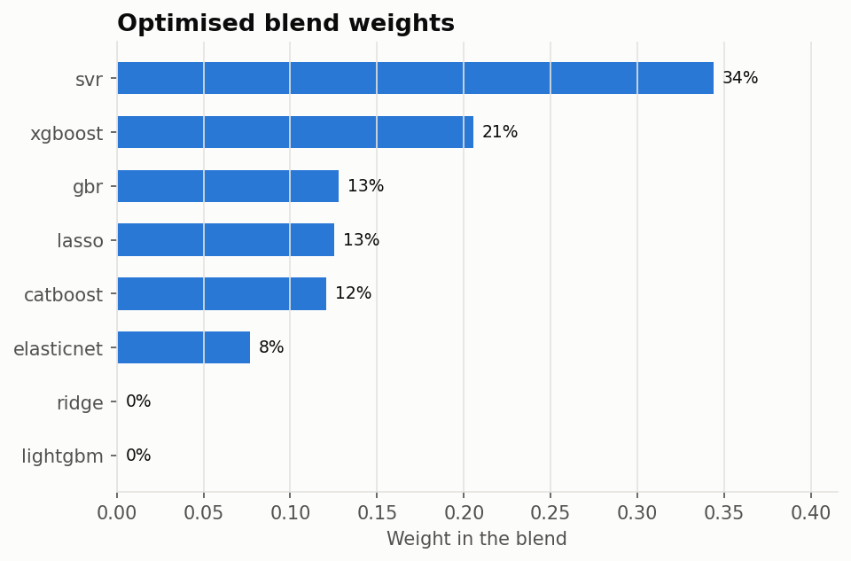
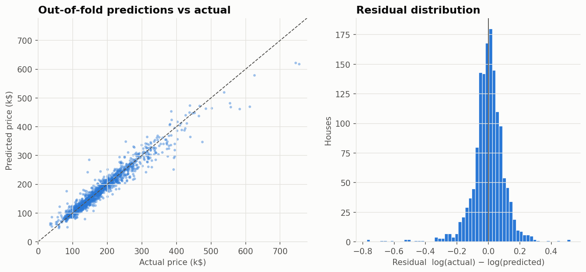
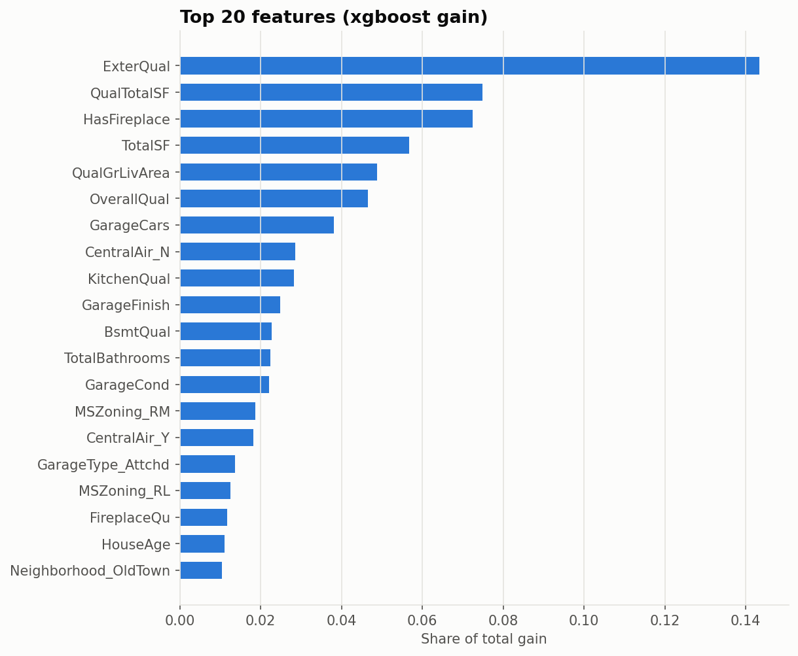

# 🏠 House Price Prediction — Kaggle *House Prices: Advanced Regression Techniques*

[](https://github.com/EddieZIDA/Kaggle-home-price-prediction/actions/workflows/tests.yml)


Predicting the sale price of 1,459 houses in Ames (Iowa) from 79 raw features, with a **leak-free
scikit-learn pipeline**, **Optuna-tuned** linear, kernel and gradient-boosting models, and an
**honestly evaluated ensemble**.

| | |
|---|---|
| **Best CV RMSLE** | **0.1071** ± 0.0080 (Blend (optimised weights), 5-fold) |
| Best single model | SVR (RBF kernel) — 0.1097 |
| Previous version of this repo | 0.1204 (and an unusable submission, see [v2 changes](#-what-changed-in-v2)) |
| Improvement | **−11 % error** |



## 🚀 Quickstart

```bash
git clone https://github.com/EddieZIDA/Kaggle-home-price-prediction.git
cd Kaggle-home-price-prediction
python -m venv .venv
.venv\Scripts\activate            # Linux/macOS: source .venv/bin/activate
pip install -r requirements-dev.txt
```

Download `train.csv` and `test.csv` from the
[competition page](https://www.kaggle.com/c/house-prices-advanced-regression-techniques/data)
into `data/raw/`, then:

```bash
python -m src.pipeline                              # CV of every model, ensemble, submission (~5 min)
python -m src.pipeline --tune --trials 40 --tune-timeout 900   # re-run Optuna first (~50 min)
python -m src.pipeline --models ridge lasso svr --no-save      # quick experiment
python -m src.predict data/raw/test.csv --out submissions/predictions.csv   # inference with the saved ensemble
pytest                                              # 20 tests
```

`python -m src.pipeline` writes:

| Output | Content |
|---|---|
| `submissions/submission.csv` | Kaggle submission, validated (1,459 rows, unique ids, prices in dollars) |
| `models/final_ensemble.joblib` | fitted ensemble, `predict_price(raw_dataframe)` |
| `models/params/*.json` | tuned hyper-parameters (versioned) |
| `results/metrics.json`, `results/cv_results.csv` | scores, blend weights, library versions |
| `results/oof_predictions.csv` | out-of-fold predictions of every model |
| `results/figures/*.png` | figures used in this README |

## 📈 Results

5-fold cross-validation, RMSLE (= RMSE on `log1p(SalePrice)`, the Kaggle metric). Every score is
out-of-fold: preprocessing, blend weights and the stacking meta-model never see the fold they are scored on.

| Model | CV RMSLE | v1 (README) |
|---|---|---|
| **Blend (optimised weights)** | 0.1071 ± 0.0080 | — |
| **Stacking (positive linear meta-model)** | 0.1072 ± 0.0080 | — |
| SVR (RBF kernel) | 0.1097 ± 0.0098 | — |
| XGBoost | 0.1114 ± 0.0055 | 0.1246 |
| Lasso | 0.1117 ± 0.0069 | 0.1261 |
| ElasticNet | 0.1119 ± 0.0070 | — |
| CatBoost | 0.1122 ± 0.0057 | — |
| Gradient Boosting (Huber) | 0.1129 ± 0.0088 | — |
| LightGBM | 0.1130 ± 0.0077 | 0.1295 |
| Ridge | 0.1138 ± 0.0079 | 0.1297 |
| Random Forest *(baseline)* | 0.1281 ± 0.0084 | 0.1412 |
| Linear Regression *(baseline, unregularised)* | 0.2053 ± 0.1530 | diverged (1e11) |

v1 scores are the ones claimed in the previous README; they were produced by a different, leaky pipeline
and are shown for reference only.

> **Honest note on tuning.** Because Optuna searches on different folds than the ones used for reporting,
> the table shows what tuning really buys: little. Tuned XGBoost scores 0.1114 on the evaluation folds versus
> 0.1104 with hand-picked defaults — both within the fold-to-fold noise (± 0.006). The large gains of v2 come
> from the data work (missing-means-absent, ordinal scales, quality × surface features, skew correction:
> Lasso goes from 0.1261 to 0.1117) and from mixing linear/kernel models with boosted trees.

**Blend weights** (non-negative, sum to 1, optimised on out-of-fold predictions):

<p align="center"></p>

Linear/kernel models and boosted trees make fairly different errors, which is why mixing them helps.



<p align="center"></p>

## 🔬 Methodology

**Data** (`src/data.py`)
- The 2 houses > 4,000 sq ft sold for < $300k (partial sales flagged by the dataset author) are removed — **train only**; every test house is predicted.
- Target: `log1p(SalePrice)`, applied in exactly one place; `expm1` in exactly one place.

**Features** (`src/features.py`, all learned on the training fold only)
- *Missing means absent*: for garage, basement, fireplace, pool, fence… a missing value means "none" (the EDA shows the 81 missing `GarageType` are exactly the 81 houses with `GarageArea = 0`). They become `"None"` / `0`, not the mode.
- `LotFrontage` imputed with the median of its neighbourhood; `GarageYrBlt` of garage-less houses (and the `2207` typo in test) set to `YearBuilt`.
- Quality scales (`Po` → `Ex`, basement finish, garage finish, functionality…) encoded as **ordinals**; `MSSubClass` and `MoSold` treated as categories.
- 15 engineered features: `TotalSF`, `QualTotalSF` (quality × surface), `QualGrLivArea`, `TotalBathrooms`, `HouseAge`, `RemodAge`, `TotalPorchSF`, `OverallScore`, `IsNew`, `IsRemodeled`, `HasGarage`, `HasBsmt`, `Has2ndFlr`, `HasFireplace`, `HasPool`.
- One-hot encoding learned on train (`handle_unknown="infrequent_if_exist"`, rare levels grouped).
- For linear models / SVR: `log1p` of skewed features (skewness learned on train) and `RobustScaler`.

**Models** (`src/models.py`): Ridge, Lasso, ElasticNet, SVR (RBF), Gradient Boosting (Huber loss), XGBoost,
LightGBM, CatBoost; plain linear regression and random forest as baselines. Each model is a single
`Pipeline(preprocessing → estimator)`, so cross-validation refits the preprocessing on every fold.

**Tuning** (`src/tuning.py`): Optuna TPE with a fixed seed, run on **different CV splits** (seed 2024) than
the ones used to report scores (seed 42), to limit the optimistic bias of tuning and evaluating on the same folds.

**Ensembling** (`src/ensemble.py`)
- *Blend*: non-negative weights summing to 1, found with SLSQP on out-of-fold predictions.
- *Stack*: linear meta-model with positive coefficients on out-of-fold predictions.
- Both are scored with an outer CV over the out-of-fold matrix; the better one is refitted and used for the submission.

## 🧰 What changed in v2

An audit of v1 found that the pipeline could not produce a valid submission. v2 is a rewrite:

| v1 problem | Impact | v2 |
|---|---|---|
| `log1p` applied twice to `SalePrice` (processing notebook + modeling notebook) | all notebook scores meaningless; submission contained prices ≈ **11.7 $** | single transform in `src/data.py`; `validate_submission` rejects log-space prices |
| Test set encoded with its **own** `OneHotEncoder` (`drop="first"`) | 99 % of test houses encoded as *floor furnace*, `CompShg` roofs as *clay tile*, 729 fireplaces as *excellent* | one preprocessing pipeline fitted on train, reused on test |
| Missing values imputed by the mode | 690 houses without fireplace rated *Good* | "missing = absent" handling + ordinal scales |
| Test imputed with test statistics; outliers removed from test in `src/` | leakage; submission with missing rows | all statistics learned on train; outliers train-only |
| `python -m src.*` commands crashed (`KeyError`, feature mismatch) or saved **unfitted** models | README commands unusable | single tested CLI: `python -m src.pipeline` |
| Optuna tuned and scored on the same folds, unseeded | optimistic, non-reproducible scores | separate tuning folds, seeded sampler |
| LightGBM `subsample` without `subsample_freq`, `num_leaves` > 2^`max_depth` | tuned parameters with no effect | fixed |
| README scores not produced by the code (e.g. 0.1184 stacking) | unverifiable claims | README numbers generated from `results/metrics.json` |
| No tests, unpinned deps, TensorFlow required but unused | fragile setup | 20 pytest tests, CI, pinned `requirements.txt`, TensorFlow removed |

## 📁 Project structure

```
home_price_prediction/
├── src/
│   ├── config.py          # paths, seeds, CV settings
│   ├── data.py            # loading, outliers, target transform
│   ├── features.py        # HouseFeatureEngineer, SkewCorrector, build_preprocessor()
│   ├── models.py          # model zoo (Pipeline per model) + tuned params loading
│   ├── tuning.py          # Optuna search spaces
│   ├── evaluation.py      # out-of-fold cross-validation
│   ├── ensemble.py        # blend / stack + EnsembleRegressor
│   ├── submission.py      # submission writing + validation
│   ├── visualization.py   # README figures
│   ├── pipeline.py        # CLI: python -m src.pipeline
│   └── predict.py         # CLI: python -m src.predict
├── notebooks/
│   ├── 01_eda.ipynb             # exploratory analysis
│   ├── 02_preprocessing.ipynb   # the preprocessing pipeline, step by step
│   └── 03_modeling.ipynb        # CV, ensemble, error analysis, submission
├── tests/                 # pytest (synthetic data + integration tests on the Kaggle files)
├── models/params/         # tuned hyper-parameters (versioned)
├── results/               # metrics + figures (versioned)
├── data/raw/              # Kaggle CSVs (not versioned)
├── .github/workflows/     # CI: ruff + pytest
├── requirements.txt / requirements-dev.txt
└── pyproject.toml
```

## 🎯 Next steps

- Nested cross-validation to fully remove the tuning bias from the reported score.
- Target encoding of `Neighborhood` inside the CV folds; native categorical handling in CatBoost.
- SHAP values for per-house explanations.
- Seed averaging of the boosted models.

## 👤 Author

**Eddie ZIDA** — [GitHub](https://github.com/EddieZIDA) · [LinkedIn](https://linkedin.com/in/eddiezida)

Data: Kaggle *House Prices: Advanced Regression Techniques* (Dean De Cock, Ames Housing dataset). Educational project.
